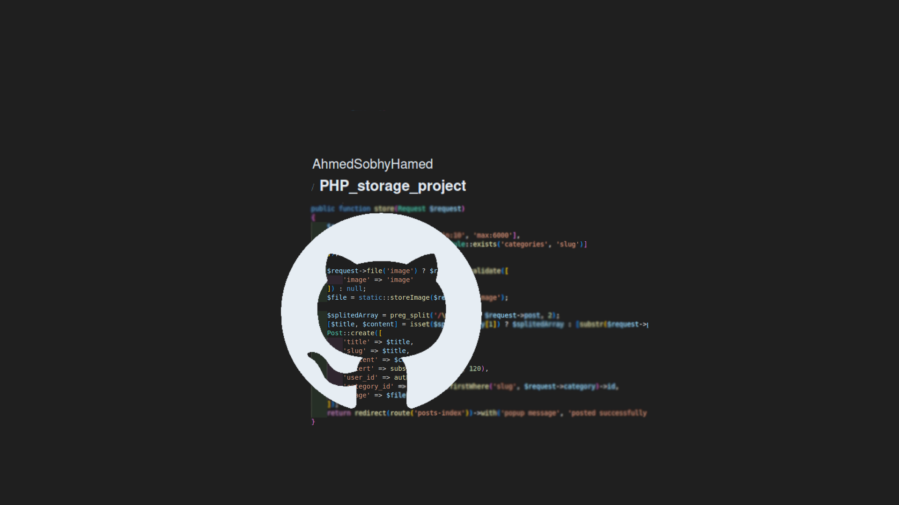
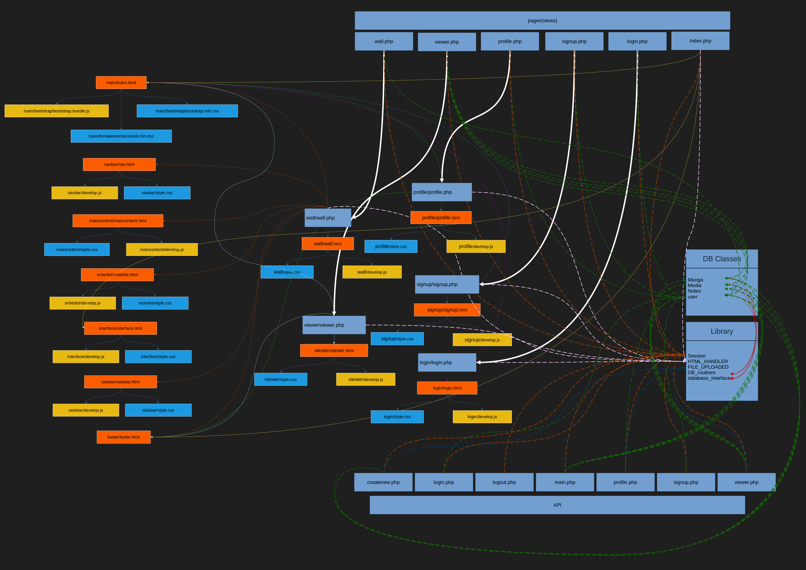

# PHP_storage_project

The website can store videos, images, stories or book details, and daily notes for users.



## Table of Contents

- [Introduction](#introduction)
- [Features](#features)
- [Installation](#installation)
- [Usage](#usage)
- [Technologies Used](#technologies-used)
- [Project Structure](#project-structure)
- [License](#license)
- [Contact](#contact)

  <!-- intro -->

## Introduction

This project was created using vanilla PHP, vanilla JavaScript, and the Bootstrap CSS framework to create a user interface for storing videos, images, stories or book details, and daily notes.
<br>
To use this storage system, you must either sign in if you are already registered, or register a new account.
<br>
Each user can see only their own resources.
<br>
You can edit any resources whenever you wish, and you can also delete them.
<br>
You can create a new resource of any type you want.

  <!-- technologies was used with links if available -->

## Features

```diff
- PHP
  - Using pre-made PHP library.
  - Separate HTML from PHP.
  - Easy content changes of HTML templates with PHP.
  - Class for file handler with validation checks for size and type.
  - Class for session handling.
  - Protection against session hijacking.
  - Protection against Session fixation.
  - Manipulate session settings from PHP script.
  - Using coockies.
  - Create an interface for the database.
  - Separate database routines inside classes for users and resources.
  - Adopt the Object-Relational Model approach when creating resource and user classes.
  - Using the MySQLi interface to connect to the database.
  - Utilize hashing and encryption
  - Validate data for every database resource model.
  - Prevent SQL injection.
  - Using regular expressions.
  - Create a custom non-standard API.
- JavaScript
  - Asynchronous communication using XMLHttpRequest.
  - Event handling.
  - DOM manipulation.
  - Create a custom media API.
  - Form validation.
  - Using regular expressions.
- SQL
  - Create a user with restricted permissions.
  - Full CRUD system.

```

  <!-- get start and how to run with the prerequisites mintion -->

## Installation

1. install pre-requisies utilities

   - install php
     on Ubuntu, Debian, and Linux Mint:

     ```sh
     sudo apt-get install php8.1 php8.1-cli php8.1-common php8.1-curl php8.1-mysql
     ```

   - install mysql
     on Ubuntu, Debian, and Linux Mint:

     ```sh
     sudo apt-get install mysql-client-8.0 mysql-client-core-8.0 mysql-server-core-8.0
     ```

   - install apache
     on Ubuntu, Debian, and Linux Mint:

     ```sh
     sudo apt-get install apache2
     ```

2. Clone the repository:

   ```sh
   git clone https://github.com/AhmedSobhyHamed/PHP_storage_project.git
   ```

3. Navigate to the project directory:

   ```sh
   cd work_directory
   ```

4. Create Database and User:

   - open mysql

     ```sh
     sudo mysql
     ```

   - create database

     ```sh
     CREATE DATABASE card_site;
     ```

   - create user

     ```sh
     CREATE USER IF NOT EXISTS
     'cardsite'@'localhost' IDENTIFIED WITH caching_sha2_password BY 'password'
     REQUIRE NONE
     WITH MAX_CONNECTIONS_PER_HOUR 1800 MAX_USER_CONNECTIONS 5
     PASSWORD EXPIRE NEVER FAILED_LOGIN_ATTEMPTS 5 PASSWORD REQUIRE CURRENT PASSWORD_LOCK_TIME 1;
     ```

   - grant privilages

     ```sh
     GRANT INSERT,UPDATE,DELETE,SELECT,CREATE,DROP,ALTER,REFERENCES ON `card_site`.* TO 'cardsite'@'localhost';
     FLUSH PRIVILEGES;
     ```

5. Create DB info file :

   ```sh
   cp DB_info.example.php  DB_info.php
   ```

6. Runing Apache

   ```sh
   sudo systemctl start apache2
   ```

   Then open the browser to localhost.

  <!-- usage or how to interact with this technologies like api end points and what they do -->

## Usage

<!-- **You can interact with the project via this link**
[web page on github](https://ahmedsobhyhamed.github.io/PHP_storage_project/).
<br> -->

**[see an example for user interaction.[video]](http://youtube.com)**

## Technologies Used

- languages:

  - PHP
  - mysql
  - JavaScript
  - HTML 5.
  - CSS.

- framworks and Libraries:

  - Bootstrap.
  - MySQLi interface.
  - PHP_HTML-manipulator.

    <!-- about the project and a digram of how it work -->

## Project Structure



  <!-- licance -->

## License

This project is licensed under the MIT License - see the [LICENSE](/LICENSE) file for details

  <!-- contacts -->

## Contact

Created by [Ahmed Sobhy]:

- email: [ahmed.s.abdulaal@gmail.com](mailto:ahmed.s.abdulaal@gmail.com)
- linkedin: [Ahmed Sobhy](https://www.linkedin.com/in/ahmed-sobhy-b824b7201/)
  <br>
  feel free to contact me!
